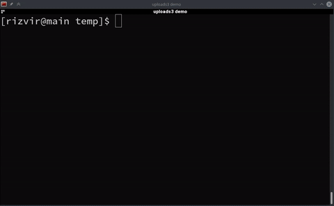

# Upload to S3 script

Quick BASH script to upload a file or directory to S3 and get a URL. It creates part of a sha1sum of the file(s) for each upload, so that you can easily upload different files with the same filename, as well as make it difficult to guess other links (eg. /h3kdfe/Screenshot_002.png, /ang49df3/Screenshot_003.png).
Depends on the AWS CLI.




## Install steps

### (Optional) CloudFront with custom domain name
- First request an Amazon Certificate Manager certificate in the us-east-1 region (regardless where you want this stack/s3 bucket in); this is because CloudFront can only work with certs in the us-east-1 region. If you're using a subdomain, and you want the request email to go to your parent domain, you can use something like:
	aws --region us-east-1 acm request-certificate --domain-name files.yourdomain.com --domain-validation-options "DomainName=files.yourdomain.com,ValidationDomain=yourdomain.com"
  Note down the ARN of the certificate

- Create a CloudFormation stack using the [uploads3_cloudformation.yml](uploads3_cloudformation.yml) template

- Go to the Stack Output and get the ScriptUserAccessKey & ScriptUserSecretKey, and use it to create a uploads3 profile in your AWS CLI, eg. :
 ~/.aws/config
 ```
 [profile uploads3]
output = json
region = ap-southeast-2
```
~/.aws/credentials
```
[uploads3]
aws_access_key_id = ABCDE12345667
aws_secret_access_key = 123456$1234etc
```


### Script setup

- If you haven't used the CloudFormation template, then create an S3 bucket, along with a user with an access/secret key to access that bucket, and configure your AWS CLI. Optionally, create a new profile in your AWS CLI (eg. called uploads3) with that/your user that can write to that bucket.

- Keep a config file called ~/.uploads3.conf with:
```bash
# Upload S3 config
aws_profile="uploads3"
bucket="files.yourdomain.com"
# With CloudFront (using the CloudFormation template):
base_url="https://$bucket"
# Without CloudFront
base_url="https://s3-ap-southeast-2.amazonaws.com/$bucket"
```

- Keep the uploads3 script somewhere (eg ~/bin or /usr/local/bin)

- Test an upload: `uploads3 ~/somefile.jpg`


